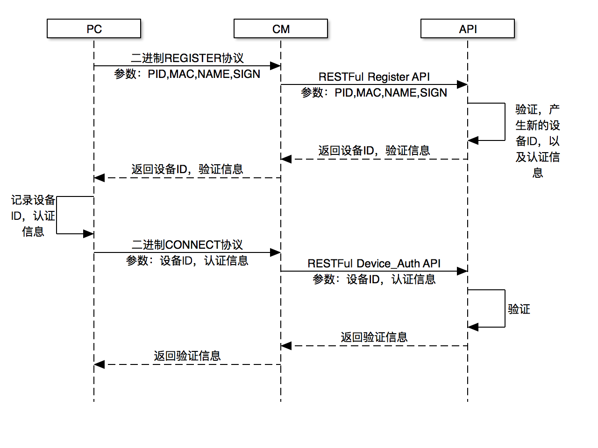

# 云智易Windows设备注册设计

* 用来完成Windows设备在云智易平台的注册功能

## 流程



## PC<->CM 二进制协议

### REGISTER()

#### *发送 PC->CM*

| 字节 | 描述 | 值 |
| --- | --- | --- |
| byte 1 | Version | 0x01 |
| byte 2 ～ byte 33 | Product id, 32个字符的字符串 | 1607d2acea9bb6001607d2acea9bb601 |
| byte 34 ~ byte 39 | Signature, 注册验证码，通过Product Key, Product Key, MAC, 时间戳 算出来的签名, MD5的实际数值 | 0123456789ABCDEF |
| byte 40 ~ byte 43 | 时间戳 | 12345678 |
| byte 44 ~ byte 45 | MAC长度 | 0~32 |
| byte 46 ~ byte n | MAC，机器码 | UTF8字符串 |
| byte n + 1 ~ byte n + 3 | 机器名称长度 | 0~32 |
| byte n + 4 ~ byte n + m | 机器名称 | UTF8字符串 |

#### *应答 CM->PC*

| 字节 | 描述 | 值 |
| --- | --- | --- |
| byte 1 | 应答0：激活成功，后面会带上DeviceID和Authorize等信息 | 0 |
| byte 2 ~ byte 5	| 设备ID，整形，最多9位 | 10000001 |
| byte 6 ~ byte 7 | 认证信息字串长度 | 16 |
| byte 8 ~ byte 23 | 认证信息，16位字符串| abcdabcdabcd |

## CM<=>API RESTFul接口

### 设备注册

#### Request

*URL*

```
POST /v2/product/{product_id}/device_register
```

*Header*

```
Content-Type:"application/json"
Access-Token:"调用凭证"
```

*Content*

```
{
    "signature" : "注册验证签名",
    "mac" : "机器地址码",
    "timestamp" : 12345678,
    "name" : "机器名称",
}
```
| 字段 | 是否必须 | 描述 |
| ---- | ---- | ---- |
| signature | 是 | 注册验证码，MD5_32，通过ProductKey，MAC，timestamp计算而出 |
| mac | 是 | 机器地址码，字符串，长度 2~32 |
| name | 否 | 机器名称，字符串，长度 0~32 |
| timestamp | 是 | 时间戳，整形 |

#### Response

*Header*

```
HTTP/1.1 200 OK
```

*Content*

```
{
    "device_id":"设备ID",
    "authorize_code":"认证码"
}
```

| 字段 | 是否必须 | 描述 |
| ---- | ---- | ---- |
| device_id | 是 | 平台分配的设备ID |
| authorize_code | 是 | 平台分配的设备登录到平台的认证码 |
