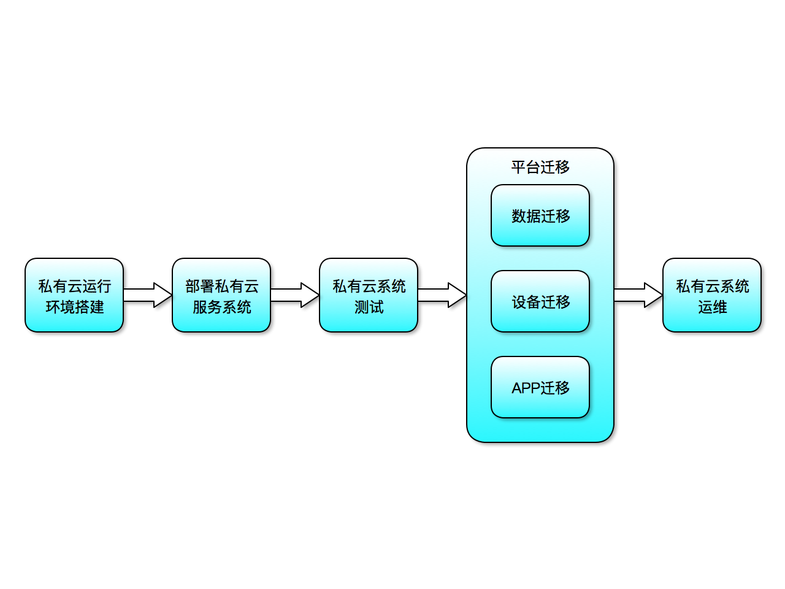
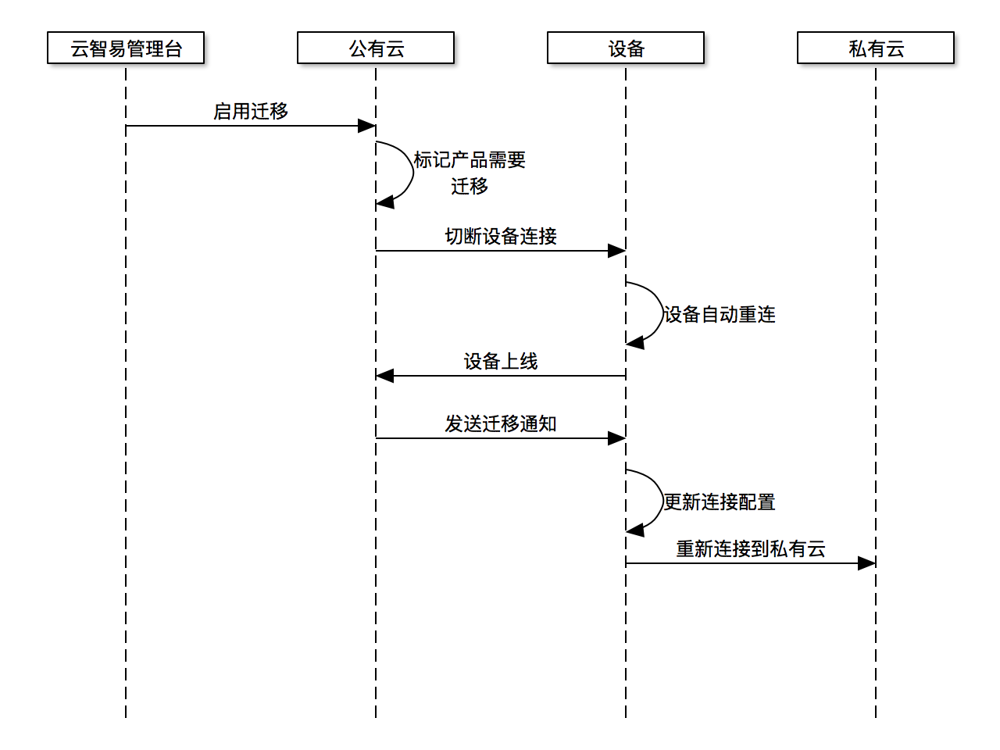
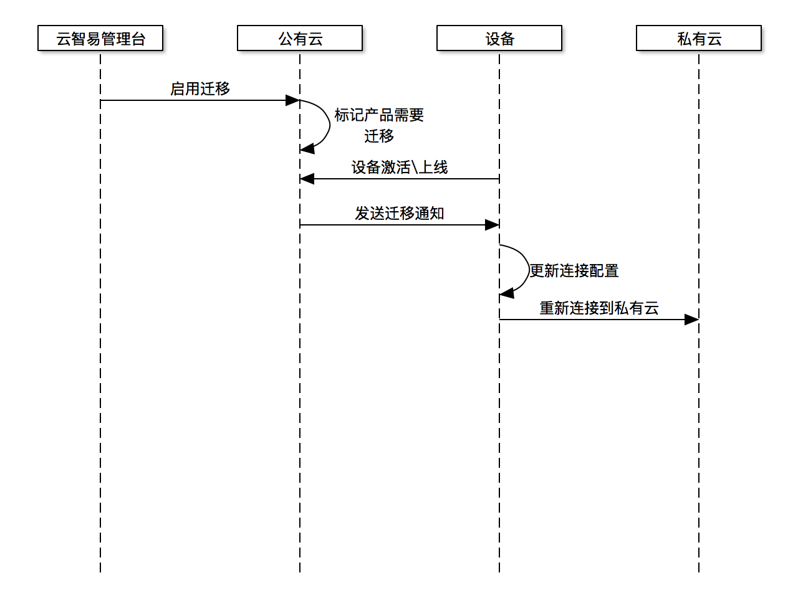

# 云迁移API接口

## 云迁移流程



## 名词解释

* **云智易企业管理后台** : 用于云智易平台管理员管理云智易平台下的厂商。
* **云智易企业管理台** : 用于云智易厂商登录后管理自己的智能硬件产品和设备、用户和其他数据。

## 技术约束

* 在云智易企业管理后台，由云智易的后台管理员开启企业向私有云迁移的功能。
* 不提供厂商自行在自己帐号下配置私有云迁移的功能。
* 云智易支持公有云向私有云的迁出，但不支持从私有云向公有云的迁入。
* 由于需要迁移数据，厂商开启云迁移到云迁移生效，期间时间云智易平台只提供基本的设备连接和APP控制功能，其他所有数据操作，如添加产品，添加设备，数据桶操作，日志数据产生等功能都会停止。一直到数据迁移完毕，厂商进入自私有平台后方可使用。并且同时云智易会切断所有连接到云智易公有云下的所有设备、APP的连接，触发设备、APP进入云迁移动作。
* 迁移完毕的厂商，无法再登入云智易共有管理台，会提示“厂商数据已经迁移，请移步私有云进行操作。”

## 管理台接口设计

* 接口概览：
  1. 开启云迁移
  2. 取消云迁移
  3. 完成云迁移
  4. 获取云迁移配置
  5. 修改云迁移配置

### 1. 开启云迁移

* 将厂商帐号锁定，进入迁移流程，在该状态下，厂商下的产品设备，还是会连接到云智易公有云，但是云智易只提供基本的连接和控制功能，其他所有数据功能将暂不提供。包括登录云智易管理台的厂商帐号也不提供。

**Request**

*URL*

```
POST /v2/corp/move
```

*Header*

```
Content-Type:"application/json"
Access-Token:"调用凭证"
Corp-ID:"企业ID"
```

*Content*

```
{
  "cm" : "cm.xxxx.xxx:port",
  "console" : "http(s)://console.xxxx.xxx:port",
  "api" : "http(s)://api.xxxx.xxx:port"
}
```

| 字段 | 类型 | 是否必须 | 说明 |
| --- | --- | --- | --- |
| cm | string | 是 | 迁移后的平台CM服务器的连接地址,域名或IP加上端口 |
| console | string | 是 | 迁移后的企业管理台登录页面地址,http\https, 域名或IP加上端口 |
| api | string | 是 | 迁移后的私有云API地址,http\https, 域名或IP加上端口 |

**Response**

*Header*

```
HTTP/1.1 200 OK
```

*Content*

```
无
```

### 2. 取消云迁移

* 当平台启动了云迁移，到云迁移还未完成的时间段中，提供取消云迁移的功能。将厂商在云智易平台下帐号的所有功能还原启动。
* 已经进行迁移了的厂商，不能再还原。

**Request**

*URL*

```
DELETE /v2/corp/move
```

*Header*

```
Content-Type:"application/json"
Access-Token:"调用凭证"
Corp-ID:"企业ID"
```

*Content*

```
无
```

**Response**

*Header*

```
HTTP/1.1 200 OK
```

*Content*

```
无
```

### 3. 完成云迁移

* 当私有云测试完毕，可以进行连接动作，以及进行管理时，云智易管理后台确认其迁移完成。
* 已经确认的迁移动作，将不可再取消，厂商将再不能通过其帐号登录云智易公有云。

**Request**

*URL*

```
PUT /v2/corp/move/confirm
```

*Header*

```
Content-Type:"application/json"
Access-Token:"调用凭证"
Corp-ID:"企业ID"
```

*Content*

```
无
```

**Response**

*Header*

```
HTTP/1.1 200 OK
```

*Content*

```
无
```

### 4. 获取云迁移配置

**Request**

*URL*

```
GET /v2/corp/move
```

*Header*

```
Content-Type:"application/json"
Access-Token:"调用凭证"
Corp-ID:"企业ID"
```

*Content*

```
无
```

**Response**

*Header*

```
HTTP/1.1 200 OK
```

*Content*

```
{
  "state" : 0/1/2/3,
  "cm" : "cm.xxxx.xxx:port",
  "console" : "http(s)://console.xxxx.xxx:port",
  "api" : "http(s)://api.xxxx.xxx:port"
}
```

| 字段 | 类型 | 是否必须 | 说明 | 默认值 |
| --- | --- | --- | --- |
| state | int | 是 | 云迁移状态，见附录 | 0 |
| cm | string | 否 | 迁移后的平台CM服务器的连接地址,域名或IP加上端口 | -- |
| console | string | 否 | 迁移后的企业管理台登录页面地址,http\https, 域名或IP加上端口 | -- |
| api | string | 否 | 迁移后的私有云API地址,http\https, 域名或IP加上端口 | -- |

### 5. 修改云迁移配置

**Request**

*URL*

```
PUT /v2/corp/move
```

*Header*

```
Content-Type:"application/json"
Access-Token:"调用凭证"
Corp-ID:"企业ID"
```

*Content*

```
{
  "cm" : "cm.xxxx.xxx:port",
  "console" : "http(s)://console.xxxx.xxx:port",
  "api" : "http(s)://api.xxxx.xxx:port"
}
```

| 字段 | 类型 | 是否必须 | 说明 |
| --- | --- | --- | --- |
| cm | string | 否 | 迁移后的平台CM服务器的连接地址,域名或IP加上端口 |
| console | string | 否 | 迁移后的企业管理台登录页面地址,http\https, 域名或IP加上端口 |
| api | string | 否 | 迁移后的私有云API地址,http\https, 域名或IP加上端口 |

**Response**

*Header*

```
HTTP/1.1 200 OK
```

*Content*

```
无
```

## 附录

### 1. 云迁移状态

| 定义 | 值 | 说明 |
| --- | --- | --- |
| Undefined | 0 | 未配置 |
| Start | 1 | 已经开启了迁移过程 |
| Cancel | 2 | 迁移过程取消了 |
| Confirmed | 3 | 迁移已经完成 |


## CM到管理台接口修改

* 已经上线设备迁移流程：

* 未上线设备迁移流程：

* 为了实现厂商已经出场的设备，先连接到公有云再切换到私有云的功能，需要在CM到API的接口做一些配合工作。
* 概览
  1. 设备激活
  2. 设备认证

### 设备激活

* 设备激活时，CM到API访问，如果发现厂商下面设备已经激活，返回特定错误码，并且返回配置的迁移的CM服务器地址。

### 设备认证

* 设备认证时，CM到API访问，如果发现厂商下面设备已经激活，返回特定错误码，并且返回配置的迁移的CM服务器地址。
